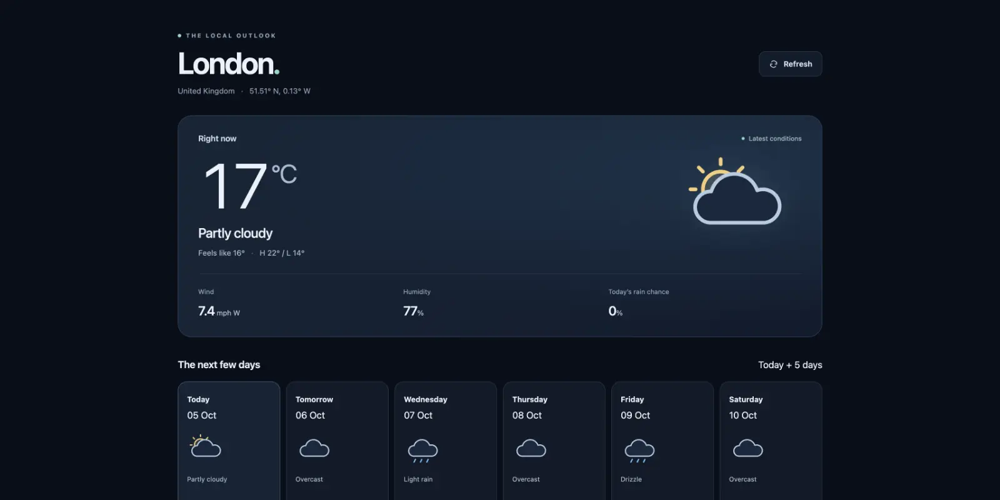
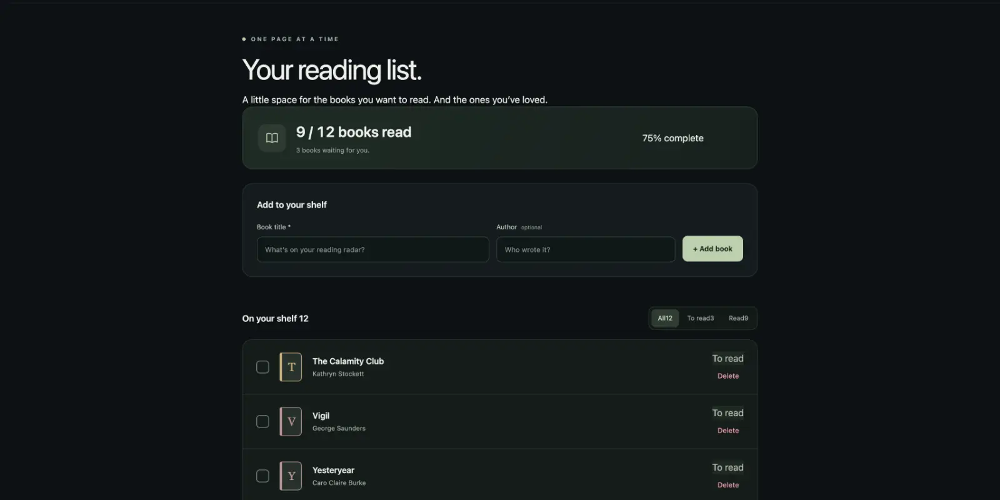
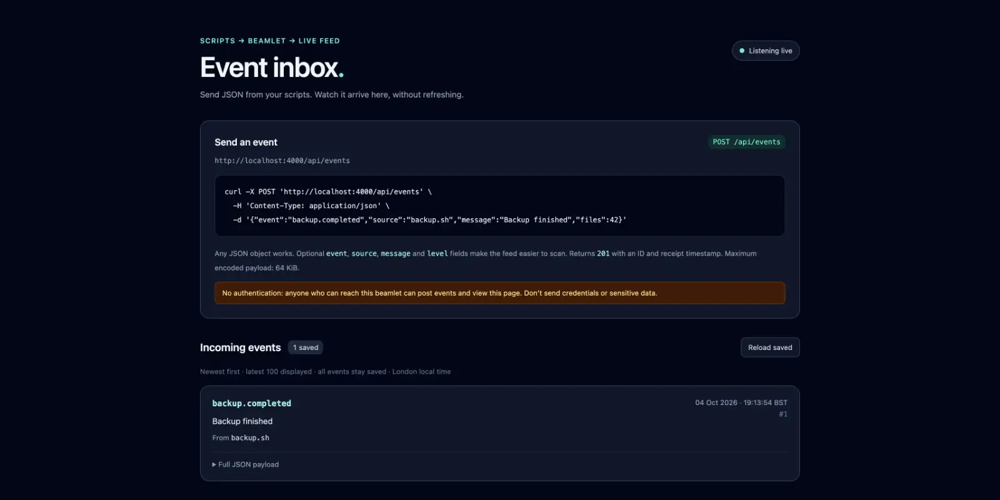
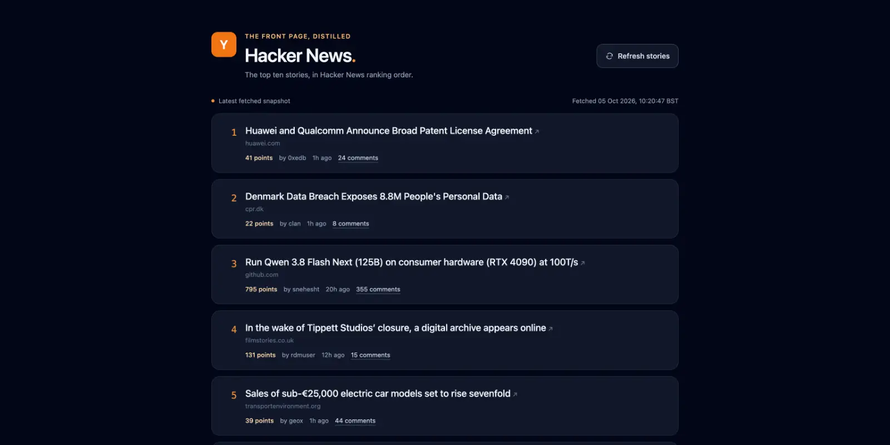

# Working with your beamlet

Ask for what you want in plain words. Everything the agent makes is a module, a page or a table on your beamlet, and it stays there for the next chat, and the next client, to build on.

## Things to try

Each of these built something good first time. Start a new chat and type one in. Change a word and each becomes your own: a different city, films instead of books.

### A weather page

> Make me a page on my beamlet that shows the weather in London right now and for the next few days.

<figure>
  
  <figcaption>A page at <code>/weather</code> with the current conditions and a forecast, from a public weather API.</figcaption>
</figure>

### A reading list

> Build me a reading list on my beamlet at /books where I can add books and tick them off when I've read them.

<figure>
  
  <figcaption>A page at <code>/books</code> with a form to add books, kept in a table in the agent database.</figcaption>
</figure>

### An event inbox

> I want somewhere on my beamlet to send events from my scripts. Make an endpoint I can POST JSON to, and a page that shows them live as they come in.

<figure>
  
  <figcaption>An endpoint to <code>curl</code> your events to, and a page where each one appears as it arrives.</figcaption>
</figure>

### The top of Hacker News

> Pull the current top 10 Hacker News stories into a page on my beamlet, with a button to refresh them.

<figure>
  
  <figcaption>A page of the stories, fetched again when you press the button.</figcaption>
</figure>

## Bigger ideas

These take more than one prompt. In each, your beamlet holds the code and the data, and your AI client brings the reasoning.

- **A bridge to your email.** The agent writes a client for your mail provider's HTTP API, and perhaps a page to triage from. Your AI client then reads, sorts and drafts, with the bridge as its hands.
- **Memory shared across clients.** A project log, the decisions you've made, notes on what you've read. Claude Code on your laptop and ChatGPT on your phone read and add to the same one.
- **A personal API.** An endpoint your scripts, a Shortcut or a home sensor post to: habits, expenses, readings. Later you ask the agent how your month went.
- **A webhook catcher.** GitHub, Stripe or your home automation send their events in. In the morning, ask what happened overnight.
- **Tools it builds for itself.** When the agent keeps doing the same job, ask it to make a module for it: a parser for a format you keep meeting, a calculator for your work. Every chat after that, in every client, can call it.

## What the agent is doing

Your client has three tools on your beamlet:

- `eval` runs Elixir code. The agent uses it to look around, to try things and to call what it has built.
- `define` adds a module, or replaces one.
- `patch` edits a module in place.

`Beamlet.MCP.Eval`, `Beamlet.MCP.Define` and `Beamlet.MCP.Patch` describe each tool's input and limits.

Every module is saved as a source file in the code dir and committed to git, with the token that made it as the author. The pages and endpoints it mounts are served from your beamlet's address. Its data goes in the agent database, a SQLite file. [Operating a beamlet](operating-a-beamlet.md#reading-what-it-built) shows how to read that history from the shell.

Each `eval` starts fresh, and nothing is carried over from one chat to the next. What lasts is what's on your beamlet. So a new chat, or a different client, picks up where the last one left off, and the agent is told to read what's there before it builds.

## Getting good results

- **Name your beamlet first.** Your client may have other tools. In a chat's first prompt, say "on my beamlet", or start by asking what's on it. After that the agent knows where to work.
- **Say what you want, not how.** "A page where I can tick books off", not "a LiveView with a click handler". The agent works out the how.
- **Let it read first.** On a busy beamlet, ask it to look at what's there before it builds, so it extends what exists rather than starting again.
- **Ask it to show you.** What's on my beamlet? Which pages are mounted? Show me the source of what you just wrote.
- **Take small steps.** Get the page working, then add the filter, then the API.
- **Steer with Elixir if you know it.** You don't need to write any. If you do know it, you can ask for a migration rather than "a table", or read the source it prints and ask for changes.

## What to expect

The frontier models and strong open-weight models all do well. Models small enough to run at home can be suitable for smaller isolated tasks, but struggle with longer coding sessions which demand a large context window.

Expect the agent to hit errors and fix them as it goes. It writes some code, your beamlet answers with an error saying what to do instead, and it tries again. That's the normal loop, not a fault.

If a client can't see `define` or `patch`, its token's policy withholds them. [Tokens and policies](tokens-and-policies.md) explains how to change that.

## When something goes wrong

**"Not permitted by your policy".** The agent reached for something its token's policy refuses. It usually finds another way. If it shouldn't be refused, change the policy, in [Tokens and policies](tokens-and-policies.md#writing-one).

**A tool times out, or the client says "Server unavailable".** An eval or a compile ran past its limit, 30 seconds by default. Ask for the work in smaller pieces, or raise the timeouts, in [Operating a beamlet](operating-a-beamlet.md#environment-variables).

**A page answers 404.** Its route isn't mounted. Ask the agent which routes are mounted, and to mount the page again.

**A request to a host on your network is refused.** Agent code reaches only the public internet unless you allow a host, in [Operating a beamlet](operating-a-beamlet.md#firewall).

**Your client asks you to sign in again.** Its token expired or was deleted. An OAuth client stays signed in while you use it at least once a month. Sign in again, or [create a new token](tokens-and-policies.md#creating-and-managing-tokens) for a client that uses one.

**A module is quarantined.** Its source file no longer compiles, usually after an edit by hand in the code dir, so your beamlet set it aside when it started. Ask the agent to list the modules. It shows the error and can fix it.

## Where next

- [Tokens and policies](tokens-and-policies.md) to connect another client or limit what one can do.
- [Operating a beamlet](operating-a-beamlet.md) for where all this lives on disk, and how to look after it.
